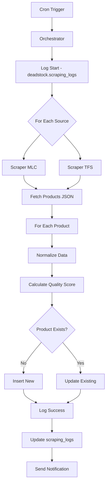

# 🕷️ PLAN DE SCRAPING - Textiles Deadstock

**Date** : 27 décembre 2025  
**Phase** : Phase 0 - Conception  
**Version** : 1.1  
**Dernière MAJ** : 27 décembre 2025 - 17:45  

---

## ⚠️ NOTE IMPORTANTE - NORMALISATION EN ANGLAIS

**Décision Architecture** : Toutes les données sont normalisées en **ANGLAIS** dans la database.

**Rationale** :
- ✅ Standard international (textile/mode)
- ✅ Scale futur (sources IT, ES, DE, etc.)
- ✅ Database propre (pas de doublons FR/EN)
- ✅ API-friendly (clients internationaux)

**Traductions** : Gérées côté frontend via i18n layer (FR, EN, ES, IT...)

**Impact Scraping** :
- Sources FR (MLC) : Normalisation FR → EN
- Sources EN (TFS) : Passthrough direct
- Futures sources : Toutes → EN

Voir section **"Stratégie de Normalisation Globale"** pour détails complets.

---

## 🎯 Objectif

Définir la stratégie complète de scraping pour agréger les textiles deadstock depuis :
1. **My Little Coupon** (mylittlecoupon.fr) - France
2. **The Fabric Sales** (thefabricsales.com) - Belgique

---

## 📊 Vue d'Ensemble

### Sources Ciblées MVP (Phase 1)

| Source | URL | Pays | Priorité | Volume Estimé | Fréquence MAJ |
|--------|-----|------|----------|---------------|---------------|
| **My Little Coupon** | https://mylittlecoupon.fr | 🇫🇷 France | P0 | 300-500 refs | Quotidien |
| **The Fabric Sales** | https://thefabricsales.com | 🇧🇪 Belgique | P0 | 200-400 refs | Hebdo (drops) |

### Objectifs MVP (Phase 1)
- **2 sources** opérationnelles
- **500-900 textiles** en base
- **Taux de succès scraping** : >90%
- **Synchronisation** : Quotidienne (MLC) + Hebdomadaire (TFS)
- **Temps scraping total** : <10 minutes par run

### Timeline
- **Semaine 1-2** : Développement scrapers + tests
- **Semaine 3** : Mise en production + monitoring
- **Semaine 4** : Optimisations et debugging

---

## 🔍 ANALYSE SOURCE 1 : My Little Coupon

### 📋 Informations Générales

**URL Base** : https://mylittlecoupon.fr  
**Fondateur** : Elie (2020)  
**Modèle** : Upcycling fins de série maisons haute couture françaises/italiennes  
**Communauté** : 109K followers Instagram, 30K+ clients  
**Format** : Coupons de 3 mètres (principalement)  

### 🎯 Pages Cibles

#### Page Principale Collection
**URL** : `https://mylittlecoupon.fr/collections/all`  
**Format** : Grille de produits avec pagination

**Données à Extraire** :
- Nom du textile
- Image principale
- Prix (généralement pour 3m)
- URL produit détail
- Disponibilité (en stock / rupture)
- Badge "nouveauté" si présent

#### Page Détail Produit
**URL Pattern** : `https://mylittlecoupon.fr/products/[slug]`  
**Exemple** : `https://mylittlecoupon.fr/products/crepe-viscose-blanc-fleurs`

**Données Détaillées** :
- Nom complet du textile
- Description complète
- Composition (ex: "100% viscose", "80% coton 20% polyester")
- Type de matière (viscose, coton, lin, soie, laine, etc.)
- Couleur(s) principale(s)
- Motifs (uni, rayures, fleurs, pois, etc.)
- Provenance (Maison de couture / prêt-à-porter)
- Longueur du coupon (3m standard, ou 1-2m pour petits coupons)
- Largeur du tissu (en cm)
- Prix
- Images multiples
- Stock disponible

### 🛠️ Stratégie Technique MLC

#### Type de Site
- **Plateforme** : Shopify (probable basé sur URL patterns)
- **JavaScript** : Partial rendering (certaines données en JS)
- **API** : Shopify JSON endpoints disponibles

#### Approche Recommandée : API Shopify + HTML Parsing

**Option A : API Shopify JSON (Recommandé)**
```javascript
// Collection products
GET https://mylittlecoupon.fr/collections/all/products.json
GET https://mylittlecoupon.fr/collections/all/products.json?page=2

// Product details
GET https://mylittlecoupon.fr/products/[handle].json
```

**Avantages** :
- ✅ Données structurées JSON
- ✅ Pas de parsing HTML complexe
- ✅ Plus rapide et fiable
- ✅ Moins de risque de breakage

**Option B : HTML Scraping (Fallback)**
- Cheerio pour parsing HTML
- Sélecteurs CSS pour extraction
- Utilisé si API JSON bloquée

#### Sélecteurs CSS (si HTML parsing nécessaire)

**Page Collection** :
```css
.product-item               /* Chaque produit */
.product-item__title        /* Nom */
.product-item__price        /* Prix */
.product-item__image img    /* Image */
.product-item__link         /* URL détail */
.badge                      /* Nouveauté / Promo */
```

**Page Produit** :
```css
.product__title             /* Titre */
.product__price             /* Prix */
.product__description       /* Description */
.product__media img         /* Images */
.product-form__variants     /* Variantes si multiples */
```

### 📅 Fréquence de Scraping MLC

**Recommandé** : Quotidien (1x par jour)  
**Heure** : 6h00 AM (avant pic trafic)  
**Raison** : Stock changeant régulièrement, nouveaux coupons fréquents

**Stratégie** :
1. Scraper tous les produits collection principale
2. Pour chaque produit, fetch JSON details
3. Détecter nouveaux produits vs existants (par source_url unique)
4. Mettre à jour disponibilité des existants

### 🎨 Normalisation Données MLC

#### Champs Source → Champs DB

| Donnée MLC | Champ DB | Transformation |
|------------|----------|----------------|
| Product title | `name` | Direct |
| Description | `description` | Direct, strip HTML |
| Composition (dans desc) | `material_type` | Parser (ex: "100% viscose" → "viscose") |
| Composition détaillée | `composition` | Parser vers JSONB `{"viscose": 100}` |
| Couleur (dans titre/desc) | `color` | Extract via keywords |
| Motif (dans titre/desc) | `pattern` | Extract via keywords |
| Prix | `price_value` | Parse "49,00 €" → 49.00 |
| Coupon length (3m) | `quantity_value` | 3 (standard) |
| Unit | `quantity_unit` | "m" |
| Largeur (dans desc) | `width_value` | Parse "laize 140cm" → 140 |
| Image URL | `image_url` | Direct |
| Product URL | `source_url` | Direct (unique key) |
| "Maison de couture" | `supplier_name` | "Maison de couture française" (generic) |

#### Parsing Patterns

**Composition** :
```javascript
// Examples de textes à parser (FR source)
"100% viscose" → {viscose: 100} // EN in DB
"80% coton 20% polyester" → {cotton: 80, polyester: 20} // FR→EN normalized
"Crêpe 100% viscose" → {viscose: 100}
```

**Couleur** :
```javascript
// Extract from title or description (FR source)
"VISCOSE BLANC FLEURS" → color: "white" // FR→EN
"Coton rayé bleu marine" → color: "navy blue" // FR→EN
```

**Type de Matériau** :
```javascript
// Normalize to English
"Coton bio" → material_type: "cotton"
"Soie sauvage" → material_type: "silk"
"Laine mérinos" → material_type: "wool"
```

**Largeur** :
```javascript
// Parse patterns
"laize 140 cm" → 140
"largeur 150cm" → 150
"laize: 140" → 140
```

### ⚠️ Challenges & Solutions MLC

#### Challenge 1 : Noms de Maisons Confidentiels
**Problème** : MLC ne révèle pas les noms exacts (clause confidentialité)  
**Solution** : Utiliser "Maison de couture française/italienne" comme `supplier_name` générique

#### Challenge 2 : Descriptions Variées
**Problème** : Format description non standardisé  
**Solution** : 
- Parser avec regex flexibles
- Scorer qualité des données extraites
- Marquer champs manquants dans `missing_fields[]`

#### Challenge 3 : Stock Limité
**Problème** : Produits partent vite (édition limitée)  
**Solution** :
- Scraping quotidien pour détecter ruptures
- Marquer `available = false` si rupture détectée
- Garder l'historique (ne pas supprimer)

---

## 🔍 ANALYSE SOURCE 2 : The Fabric Sales

### 📋 Informations Générales

**URL Base** : https://thefabricsales.com  
**Pays** : Belgique  
**Modèle** : Drops hebdomadaires de deadstock designers européens  
**Format** : Vente exclusivité limitée dans le temps  
**Positionnement** : Premium Belgian fabric shop  

### 🎯 Pages Cibles

#### Page Shop/Collection
**URL** : `https://thefabricsales.com/collections/all`  
**Format** : Grille produits avec filtres

**Données Listing** :
- Nom fabric
- Image
- Prix
- Designer/Brand si mentionné
- URL produit

#### Page Produit Détail
**URL Pattern** : `https://thefabricsales.com/products/[slug]`

**Données Détaillées** :
- Nom complet
- Description
- Composition (ex: "100% cotton", "silk blend")
- Type de fabric (cotton, silk, wool, linen, etc.)
- Couleur(s)
- Pattern (prints, solid, stripes)
- Designer/Brand origin
- Quantité disponible (en mètres)
- Largeur (width en cm)
- Prix par mètre
- Prix total si quantité fixe
- Care instructions
- Images multiples
- Stock status

### 🛠️ Stratégie Technique TFS

#### Type de Site
- **Plateforme** : Shopify (basé sur structure URL)
- **JavaScript** : Partial
- **API** : Shopify JSON endpoints probables

#### Approche : API Shopify JSON

**Endpoints** :
```javascript
// Collections
GET https://thefabricsales.com/collections/all/products.json

// Product details
GET https://thefabricsales.com/products/[handle].json
```

**Même logique que MLC** : Utiliser API JSON Shopify pour données structurées

#### Sélecteurs CSS Fallback

```css
.product-card               /* Produit listing */
.product-card__title        /* Nom */
.product-card__price        /* Prix */
.product__title             /* Titre détail */
.product__description       /* Description */
```

### 📅 Fréquence de Scraping TFS

**Recommandé** : Hebdomadaire + Event-based  
**Jour** : Lundi ou après annonce drop (monitoring Instagram)  
**Raison** : Drops hebdomadaires, stock renouvelé par vagues

**Stratégie** :
1. **Scraping hebdomadaire régulier** : Tous les lundis 7h AM
2. **Scraping event-based** : Si détection nouveau drop (via RSS/social)
3. **Scraping de vérification** : Mi-semaine pour màj stock

### 🎨 Normalisation Données TFS

#### Champs Source → Champs DB

| Donnée TFS | Champ DB | Transformation |
|------------|----------|----------------|
| Product name | `name` | Direct |
| Description | `description` | Strip HTML |
| Fabric type | `material_type` | Extract (cotton, silk, wool, linen) |
| Composition % | `composition` | Parse vers JSONB |
| Color | `color` | Extract from title/desc |
| Pattern | `pattern` | Extract keywords |
| Price | `price_value` | Parse currency |
| Quantity (meters) | `quantity_value` | Parse number |
| Width | `width_value` | Parse "150cm wide" |
| Designer mention | `supplier_name` | Extract si présent, sinon "European designer" |
| Image | `image_url` | Direct |
| URL | `source_url` | Direct (unique) |

#### Parsing Patterns TFS

**Composition** :
```javascript
// Already in English - passthrough
"100% Cotton" → {cotton: 100}
"Silk Blend 70% silk 30% cotton" → {silk: 70, cotton: 30}
```

**Couleur** :
```javascript
// Already in English - passthrough
"Navy Blue Cotton" → color: "navy blue"
"White Linen" → color: "white"
```

**Type de Matériau** :
```javascript
// Already in English - passthrough
"Pure Silk" → material_type: "silk"
"Cotton Canvas" → material_type: "cotton"
```

**Quantité** :
```javascript
"5 meters available" → 5
"Sold per meter" → NULL (à calculer)
```

**Largeur** :
```javascript
"150cm wide" → 150
"Width: 140cm" → 140
```

### ⚠️ Challenges & Solutions TFS

#### Challenge 1 : Drops Hebdomadaires
**Problème** : Stock renouvelé par vagues, timing important  
**Solution** :
- Monitoring Instagram/Newsletter pour annonces drops
- Scraping immédiat après drop
- Webhook ou notification pour trigger scraping

#### Challenge 2 : Prix Variables
**Problème** : Parfois prix au mètre, parfois prix total  
**Solution** :
- Détecter format prix
- Calculer `price_per_unit` si possible
- Documenter dans `price_per_unit_label`

#### Challenge 3 : Stock Limité Drops
**Problème** : Produits partent très vite après drops  
**Solution** :
- Scraping rapide après annonce drop
- Marquer `available = false` rapidement si rupture
- Historique gardé pour analytics

---

## 🔄 STRATÉGIE DE NORMALISATION GLOBALE

### 🎯 Objectif Normalisation

Transformer données hétérogènes (sources multilingues) en format unifié **ANGLAIS** dans `deadstock.textiles`.

**Décision Architecture** : 
- **Database** : Données normalisées en **anglais** (immuable, standard international)
- **Interface** : Traductions via i18n layer selon locale utilisateur (FR, EN, ES, IT, etc.)
- **Avantages** : Scale international, pas de doublons, API-friendly

### 📊 Mapping Terminologie → ANGLAIS

#### Types de Matériaux (FR/EN → Standard ANGLAIS)

| Français (MLC) | Anglais (TFS) | **Standard DB (EN)** | Category |
|----------------|---------------|---------------------|----------|
| Coton | Cotton | **cotton** | natural |
| Soie | Silk | **silk** | natural |
| Laine | Wool | **wool** | natural |
| Lin | Linen | **linen** | natural |
| Viscose | Viscose | **viscose** | artificial |
| Polyester | Polyester | **polyester** | synthetic |
| Nylon | Nylon | **nylon** | synthetic |
| Denim/Jean | Denim | **denim** | specific |
| Velours | Velvet | **velvet** | texture |
| Dentelle | Lace | **lace** | texture |

#### Couleurs (FR/EN → Standard ANGLAIS)

| Français | Anglais | **Standard DB (EN)** |
|----------|---------|---------------------|
| Blanc | White | **white** |
| Noir | Black | **black** |
| Rouge | Red | **red** |
| Bleu | Blue | **blue** |
| Bleu marine | Navy | **navy blue** |
| Rose | Pink | **pink** |
| Vert | Green | **green** |
| Jaune | Yellow | **yellow** |
| Violet/Mauve | Purple | **purple** |
| Beige | Beige | **beige** |
| Multicolore | Multicolor | **multicolor** |

#### Motifs (FR/EN → Standard ANGLAIS)

| Français | Anglais | **Standard DB (EN)** |
|----------|---------|---------------------|
| Uni | Solid | **solid** |
| Rayures/Rayé | Stripes | **stripes** |
| Fleurs/Fleuri | Floral | **floral** |
| Pois | Dots/Polka | **dots** |
| Carreaux | Checks | **checks** |
| Géométrique | Geometric | **geometric** |
| Abstrait | Abstract | **abstract** |
| Imprimé animal | Animal print | **animal print** |

### 🌍 Internationalisation (i18n)

#### Architecture Traductions

**Database** : Données en anglais (immuable)
```json
{
  "material_type": "cotton",
  "color": "navy blue",
  "pattern": "floral"
}
```

**Frontend** : Traductions via next-intl ou i18next
```typescript
// locales/fr.json
{
  "materials": {
    "cotton": "Coton",
    "silk": "Soie",
    "wool": "Laine"
  },
  "colors": {
    "white": "Blanc",
    "black": "Noir",
    "navy blue": "Bleu marine"
  },
  "patterns": {
    "floral": "Fleuri",
    "stripes": "Rayures",
    "solid": "Uni"
  }
}

// locales/es.json
{
  "materials": {
    "cotton": "Algodón",
    "silk": "Seda",
    "wool": "Lana"
  }
  // ...
}
```

**Utilisation** :
```typescript
// Component
const { t } = useTranslation();

<div>
  <p>{t(`materials.${textile.material_type}`)}</p>
  <p>{t(`colors.${textile.color}`)}</p>
</div>

// Affichage FR: "Coton, Bleu marine"
// Affichage EN: "Cotton, Navy blue"
// Affichage ES: "Algodón, Azul marino"
```

#### Langues Supportées (Roadmap)

**Phase 1 (MVP)** : 
- 🇫🇷 Français (principale)
- 🇬🇧 Anglais

**Phase 3-4** :
- 🇪🇸 Espagnol
- 🇮🇹 Italien
- 🇩🇪 Allemand

**Phase 7+** :
- Autres langues selon demande marché

### 🔧 Fonctions Normalisation

#### 1. Parse Composition
```typescript
function parseComposition(text: string, sourceLang: 'fr' | 'en'): Record<string, number> {
  // "100% viscose" → {viscose: 100}
  // "80% cotton 20% polyester" → {cotton: 80, polyester: 20}
  // "80% coton 20% polyester" → {cotton: 80, polyester: 20} (normalized to EN)
  
  const composition: Record<string, number> = {};
  const pattern = /(\d+)\s*%\s*([a-zA-Zéèê]+)/gi;
  
  let match;
  while ((match = pattern.exec(text)) !== null) {
    const percentage = parseInt(match[1]);
    const material = normalizeMaterial(match[2], sourceLang); // Returns EN
    composition[material] = percentage;
  }
  
  return composition;
}

function normalizeMaterial(material: string, sourceLang: 'fr' | 'en'): string {
  const materialMap = {
    fr: {
      'coton': 'cotton',
      'soie': 'silk',
      'laine': 'wool',
      'lin': 'linen',
      'viscose': 'viscose',
      'polyester': 'polyester',
      // ... complete mapping
    },
    en: {
      'cotton': 'cotton',
      'silk': 'silk',
      'wool': 'wool',
      // ... passthrough for EN
    }
  };
  
  const normalized = material.toLowerCase().trim();
  return materialMap[sourceLang][normalized] || normalized;
}
```

#### 2. Extract Material Type
```typescript
function extractMaterialType(
  name: string, 
  description: string, 
  composition: any,
  sourceLang: 'fr' | 'en'
): string {
  // Returns material in ENGLISH
  
  if (composition) {
    // Return material with highest %
    const sorted = Object.entries(composition).sort((a, b) => b[1] - a[1]);
    if (sorted.length > 0) return sorted[0][0]; // Already in EN from parseComposition
  }
  
  // Search keywords in name/description and normalize to EN
  const text = (name + ' ' + description).toLowerCase();
  const materials = sourceLang === 'fr' 
    ? ['coton', 'soie', 'laine', 'lin', 'viscose', 'polyester']
    : ['cotton', 'silk', 'wool', 'linen', 'viscose', 'polyester'];
  
  for (const mat of materials) {
    if (text.includes(mat)) {
      return normalizeMaterial(mat, sourceLang); // Returns EN
    }
  }
  
  return 'unknown'; // To review manually
}
```

#### 3. Extract Color
```typescript
function extractColor(text: string, sourceLang: 'fr' | 'en'): string | null {
  // Returns color in ENGLISH
  
  const colorKeywords = {
    'white': {
      fr: ['blanc', 'ivory', 'écru'],
      en: ['white', 'ivory', 'ecru']
    },
    'black': {
      fr: ['noir'],
      en: ['black']
    },
    'red': {
      fr: ['rouge', 'bordeaux'],
      en: ['red', 'bordeaux']
    },
    'blue': {
      fr: ['bleu'],
      en: ['blue']
    },
    'navy blue': {
      fr: ['marine', 'bleu marine'],
      en: ['navy', 'navy blue']
    },
    'pink': {
      fr: ['rose'],
      en: ['pink']
    },
    'green': {
      fr: ['vert'],
      en: ['green']
    },
    // ... complete mapping
  };
  
  const normalized = text.toLowerCase();
  
  for (const [standardEN, variants] of Object.entries(colorKeywords)) {
    const keywords = variants[sourceLang];
    for (const keyword of keywords) {
      if (normalized.includes(keyword)) return standardEN; // Returns EN
    }
  }
  
  return null;
}
```

#### 4. Extract Pattern
```typescript
function extractPattern(text: string, sourceLang: 'fr' | 'en'): string | null {
  // Returns pattern in ENGLISH
  
  const patternKeywords = {
    'solid': {
      fr: ['uni'],
      en: ['solid']
    },
    'stripes': {
      fr: ['rayé', 'rayures'],
      en: ['stripes', 'striped']
    },
    'floral': {
      fr: ['fleurs', 'fleuri', 'floral'],
      en: ['floral', 'flower', 'flowers']
    },
    'dots': {
      fr: ['pois'],
      en: ['dots', 'polka']
    },
    // ... complete mapping
  };
  
  const normalized = text.toLowerCase();
  
  for (const [standardEN, variants] of Object.entries(patternKeywords)) {
    const keywords = variants[sourceLang];
    for (const keyword of keywords) {
      if (normalized.includes(keyword)) return standardEN;
    }
  }
  
  return null;
}
```

#### 4. Calculate Data Quality Score
```typescript
function calculateQualityScore(textile: any): number {
  let score = 0;
  const weights = {
    name: 10,
    description: 10,
    material_type: 15,
    composition: 15,
    color: 10,
    quantity_value: 10,
    price_value: 10,
    image_url: 10,
    width_value: 5,
    supplier_name: 5
  };
  
  for (const [field, weight] of Object.entries(weights)) {
    if (textile[field]) score += weight;
  }
  
  return score; // 0-100
}
```

### 📋 Unités Standardisées

#### Quantité
- **Standard** : mètres (m)
- **Conversions** :
  - yards → m : `value * 0.9144`
  - feet → m : `value * 0.3048`
  - cm → m : `value / 100`

#### Largeur
- **Standard** : centimètres (cm)
- **Conversions** :
  - inches → cm : `value * 2.54`
  - m → cm : `value * 100`

#### Prix
- **Standard** : EUR (€)
- **Conversions** (Phase 2+) :
  - USD → EUR : API exchange rate
  - GBP → EUR : API exchange rate

---

## 🤖 ARCHITECTURE SCRAPING

### 📁 Structure Fichiers

```
scripts/
└── scrapers/
    ├── common/
    │   ├── normalizer.ts       # Fonctions normalisation
    │   ├── parser.ts           # Parsing compositions, colors
    │   └── supabase.ts         # Client Supabase
    │
    ├── my-little-coupon/
    │   ├── scraper.ts          # Logic scraping MLC
    │   ├── config.ts           # URLs, selectors
    │   └── test.ts             # Tests unitaires
    │
    ├── the-fabric-sales/
    │   ├── scraper.ts          # Logic scraping TFS
    │   ├── config.ts           # URLs, selectors
    │   └── test.ts             # Tests unitaires
    │
    └── orchestrator.ts         # Run all scrapers
```

### 🔄 Workflow Scraping



### 🎯 Pseudo-Code Scraper

```typescript
async function scrapeMLC() {
  const log = await startScrapingLog('my_little_coupon');
  
  try {
    // 1. Fetch all products
    const products = await fetchMLCProducts();
    log.items_found = products.length;
    
    // 2. For each product
    for (const product of products) {
      try {
        // 2a. Normalize data
        const normalized = normalizeMLCProduct(product);
        
        // 2b. Calculate quality score
        normalized.data_quality_score = calculateQualityScore(normalized);
        
        // 2c. Upsert in DB (by source_url)
        await supabase
          .from('deadstock.textiles')
          .upsert(normalized, { onConflict: 'source_url' });
        
        log.items_new++; // or items_updated
        
      } catch (err) {
        log.items_failed++;
        console.error('Failed product:', product.id, err);
      }
    }
    
    // 3. Complete log
    await completeScrapingLog(log, 'completed');
    
  } catch (err) {
    await completeScrapingLog(log, 'failed', err.message);
  }
}
```

### ⏱️ Scheduling (Cron Jobs)

#### Vercel Cron (Recommandé pour MVP)

**vercel.json** :
```json
{
  "crons": [
    {
      "path": "/api/cron/scrape-mlc",
      "schedule": "0 6 * * *"
    },
    {
      "path": "/api/cron/scrape-tfs",
      "schedule": "0 7 * * 1"
    }
  ]
}
```

**API Route** : `app/api/cron/scrape-mlc/route.ts`
```typescript
export async function GET(request: Request) {
  // Verify cron secret
  const authHeader = request.headers.get('authorization');
  if (authHeader !== `Bearer ${process.env.CRON_SECRET}`) {
    return new Response('Unauthorized', { status: 401 });
  }
  
  // Run scraper
  await scrapeMLC();
  
  return Response.json({ success: true });
}
```

#### GitHub Actions (Alternative)

```yaml
# .github/workflows/scrape-daily.yml
name: Daily Scraping
on:
  schedule:
    - cron: '0 6 * * *'  # 6 AM daily
  workflow_dispatch:       # Manual trigger

jobs:
  scrape:
    runs-on: ubuntu-latest
    steps:
      - uses: actions/checkout@v3
      - uses: actions/setup-node@v3
      - run: npm ci
      - run: npm run scrape:all
```

---

## ⚠️ GESTION ERREURS & MONITORING

### 🚨 Types d'Erreurs

#### 1. Network Errors
**Symptômes** : Timeout, DNS failure, connection refused  
**Handling** :
- Retry 3x avec backoff exponentiel
- Log dans `scraping_logs.error_details`
- Alert si >3 échecs consécutifs

#### 2. Parsing Errors
**Symptômes** : Selector not found, invalid JSON  
**Handling** :
- Log produit problématique
- Continuer avec autres produits
- Alert si >10% échecs

#### 3. Data Quality Issues
**Symptômes** : Champs manquants, formats invalides  
**Handling** :
- Accepter avec `data_quality_score` bas
- Marquer `missing_fields[]`
- Review manuel si score <30

### 📊 Monitoring & Alerting

#### Métriques à Tracker
- Taux de succès par source (>90% attendu)
- Durée scraping (<10 min attendu)
- Nouveaux produits par jour
- Produits devenus indisponibles
- Score qualité moyen

#### Dashboard Monitoring (Phase 2)

```sql
-- Vue stats scraping
CREATE VIEW scraping_stats_7days AS
SELECT 
  source_platform,
  COUNT(*) as runs,
  AVG(items_found) as avg_items,
  AVG(items_failed) as avg_failures,
  AVG(duration_seconds) as avg_duration
FROM deadstock.scraping_logs
WHERE created_at > NOW() - INTERVAL '7 days'
GROUP BY source_platform;
```

#### Alerting Rules
- ✅ Si scraping échoue 2x consécutifs → Email
- ✅ Si taux échec >20% → Email
- ✅ Si durée >20 min → Email
- ✅ Si 0 nouveaux produits pendant 7 jours → Warning

---

## 🧪 TESTING STRATEGY

### Unit Tests

```typescript
// tests/normalizer.test.ts
describe('parseComposition', () => {
  it('parses simple composition', () => {
    expect(parseComposition('100% cotton'))
      .toEqual({ cotton: 100 });
  });
  
  it('parses mixed composition', () => {
    expect(parseComposition('80% coton 20% polyester'))
      .toEqual({ coton: 80, polyester: 20 });
  });
});

describe('extractColor', () => {
  it('extracts color from French text', () => {
    expect(extractColor('Viscose Blanc Fleurs'))
      .toBe('blanc');
  });
  
  it('extracts color from English text', () => {
    expect(extractColor('Navy Blue Cotton'))
      .toBe('bleu marine');
  });
});
```

### Integration Tests

```typescript
// tests/scraper-mlc.test.ts
describe('MLC Scraper', () => {
  it('fetches products from MLC', async () => {
    const products = await fetchMLCProducts();
    expect(products.length).toBeGreaterThan(0);
  });
  
  it('normalizes MLC product correctly', async () => {
    const raw = await fetchMLCProduct('test-product-slug');
    const normalized = normalizeMLCProduct(raw);
    
    expect(normalized.name).toBeDefined();
    expect(normalized.source_url).toContain('mylittlecoupon.fr');
    expect(normalized.source_platform).toBe('my_little_coupon');
  });
});
```

### Manual Testing Checklist

- [ ] Scraper MLC fetch >100 products
- [ ] Scraper TFS fetch >100 products
- [ ] Parsing composition fonctionne (10 exemples)
- [ ] Extraction couleur fonctionne (10 exemples)
- [ ] Images URLs valides
- [ ] Upsert DB sans doublon (test source_url unique)
- [ ] Logs scraping créés correctement
- [ ] Quality scores calculés (distribution 30-100)

---

## 📅 TIMELINE IMPLÉMENTATION

### Semaine 1 : Scraper MLC
**Jours 1-2** :
- [ ] Setup structure projet scrapers
- [ ] Implémenter `common/normalizer.ts`
- [ ] Implémenter `common/parser.ts`

**Jours 3-4** :
- [ ] Développer scraper MLC
- [ ] Tests avec 10-20 produits
- [ ] Debugging et ajustements

**Jour 5** :
- [ ] Tests complets (tous produits MLC)
- [ ] Fix bugs identifiés
- [ ] Documentation code

### Semaine 2 : Scraper TFS + Orchestration
**Jours 1-2** :
- [ ] Développer scraper TFS
- [ ] Adaptation normalizer pour EN
- [ ] Tests avec 10-20 produits

**Jours 3-4** :
- [ ] Orchestrator pour run both scrapers
- [ ] Setup Vercel Cron ou GitHub Actions
- [ ] Tests end-to-end

**Jour 5** :
- [ ] Monitoring et logging
- [ ] Documentation complète
- [ ] Dry-run en prod

### Semaine 3 : Production & Monitoring
**Jours 1-3** :
- [ ] Deploy en production
- [ ] Premier scraping complet
- [ ] Validation données en DB
- [ ] Vérification quality scores

**Jours 4-5** :
- [ ] Monitoring 24h
- [ ] Ajustements si nécessaire
- [ ] Documentation issues rencontrées

### Semaine 4 : Optimisations
- [ ] Améliorer performance si >10min
- [ ] Améliorer quality scores si <70 avg
- [ ] Ajouter alerting
- [ ] Préparer Phase 2 (nouvelles sources)

---

## 📋 CHECKLIST SCRAPING PRODUCTION

### Pré-Lancement
- [ ] Code scrapers testé avec >100 produits par source
- [ ] Normalizer testé avec compositions variées
- [ ] Database schema `deadstock.textiles` créé
- [ ] Service role Supabase key configurée
- [ ] Cron jobs configurés (Vercel ou GitHub)
- [ ] Monitoring dashboard accessible
- [ ] Alerting configuré (email)
- [ ] Documentation scraper complète

### Post-Lancement (J+1)
- [ ] Vérifier scraping_logs (status='completed')
- [ ] Compter textiles en DB (SELECT COUNT(*))
- [ ] Vérifier quality scores (SELECT AVG(data_quality_score))
- [ ] Vérifier images chargent
- [ ] Tester recherche full-text
- [ ] Identifier produits avec missing_fields

### Maintenance Continue
- [ ] Review logs hebdomadaire
- [ ] Ajuster parsers si nouveaux formats
- [ ] Ajouter tests pour edge cases
- [ ] Améliorer quality scoring
- [ ] Surveiller changes structure sites sources

---

## 🚀 ÉVOLUTIONS FUTURES

### Phase 2-3 (Court Terme)
- Ajouter 3-5 nouvelles sources (Nona Source, Beglarian, etc.)
- Améliorer normalisation avec ML (auto-detect couleurs)
- Scraping incrémental (seulement nouveautés)
- Cache HTTP pour optimiser vitesse

### Phase 4-6 (Moyen Terme)
- Négocier accès API direct avec sources
- Webhooks pour sync temps réel
- Scraping images et re-host sur Supabase Storage
- OCR sur images pour extraire infos manquantes

### Phase 7+ (Long Terme)
- Computer vision pour détecter motifs/couleurs auto
- Scraping reviews/ratings clients
- Scraping related products (suggestions)
- International sources (US, Asia)

---

## 🔗 RESSOURCES & RÉFÉRENCES

### Documentation Technique
- [Cheerio Documentation](https://cheerio.js.org/)
- [Puppeteer Documentation](https://pptr.dev/)
- [Supabase JS Client](https://supabase.com/docs/reference/javascript)
- [Vercel Cron Jobs](https://vercel.com/docs/cron-jobs)

### Best Practices Scraping
- Respecter robots.txt
- Rate limiting (max 1 req/sec)
- User-Agent headers appropriés
- Respect des ToS des sites

### Légalité
- Scraping données publiques = généralement OK
- Respecter RGPD (pas de données personnelles)
- Usage commercial dérivé = vérifier ToS

---

## 📝 NOTES IMPORTANTES

### Éthique Scraping
- ✅ On agrège des données publiques
- ✅ On cite toujours la source (`source_url`)
- ✅ On redirige users vers source originale
- ✅ On ne stocke pas de données personnelles
- ✅ On respecte robots.txt

### Monitoring Sites Sources
- Suivre changements structure HTML (GitHub watch)
- Tester scrapers régulièrement
- Avoir fallback si source down
- Documenter changes dans CHANGELOG

### Performance
- Paralléliser scrapers (MLC + TFS simultanés)
- Batch inserts (100 products à la fois)
- Caching results 24h si re-run nécessaire
- Monitoring durée (alert si >15min)

---

**Prochaine Action** : Développer scraper MLC (Semaine 1 Phase 1) 🚀

**Auteur** : Thomas  
**Validé** : 27 décembre 2025  
**Status** : ✅ Plan finalisé, prêt pour implémentation
